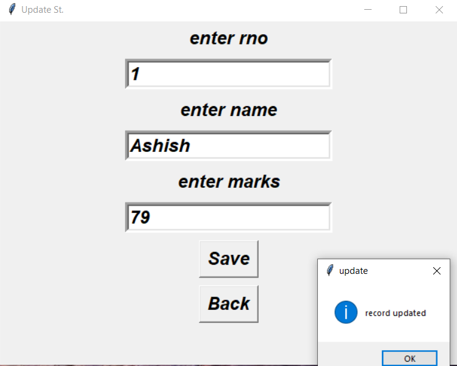

# student_management_system
Student Management System Dekstop application using python and Tkinter Gui 

# Project Title

Student Management System is  Dekstop application using python and Tkinter Gui and  sqlite3 database for database connectivity to do CRUD operations i used openweathermap api to give tempreature and location of ther person and
also used web-scrapping to display quote of the day.

# home page

# add student

# view students

# update student

# delete student

# figure

